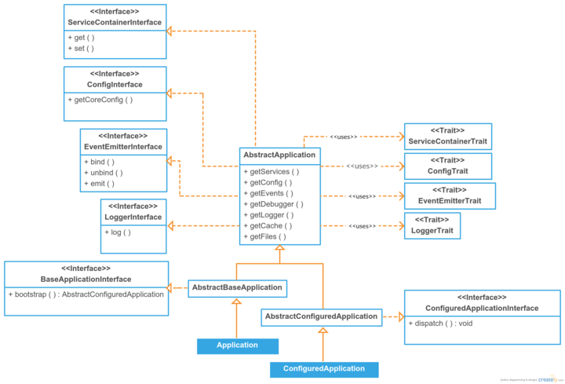

Application Core
================

.. contents::
    :depth: 1
    :local:

The Webino™ application architecture is based around the Zend Frameowrk 2 but simplified and enhanced.
It also brings some other useful open-source packages to make a web application devstack.

Application Core Lifecycle
--------------------------

The application core lifecycle is very simple and straightforward. It just bootstrap the application
and then it dispatches. Anything that should be performed on a dispatch has to be in the listeners
attached to that event.

Because of two pass application bootstrap process, the core services and listeners are initialized first.
So they are ready before first pass bootstrap event occurs. The remaining services and listeners are initialized
after the configure event, right before second pass bootstrap occurs. So only core listeners can listen to the
configure event.

.. image:: ../_static/media/WebinoAppLib.Flowchart_h400.png
    :class: centered

**Explanation:**

**1)** *Creating new application object, loading a configuration and a debugger.*

.. code-block:: php

    /** @var \WebinoAppLib\Application\AbstractBaseApplication $appCore **/
    $appCore = Webino::application($config = null, $debugger = null);

- There are two optional arguments, for the config and the debugger objects.

  - If those arguments are not provided, the application factory tries to require them from
    files ``config/application.php`` and ``config/debugger.php`` in your include path,
    if that fails too, the factory creates a default configuration and a null debugger objects.

- Finally an application is created via service manager and registered into services too.

**2)** *Initializing an application, all the services will be ready.*

.. code-block:: php

    /** @var \WebinoAppLib\Application\AbstractConfiguredApplication $app **/
    $app = $appCore->bootstrap();

- The application config is allowed for modifications during initialization.

- Calling the ``bootstrap()`` method triggers the two pass application bootstrap event.

  - First pass is handled by core listeners and it allows them to listen to the configure event and
    to a second pass of the bootstrap.

  - Then application configuration event is triggered, but skipped if cached config is available.

  - Second pass of the bootstrap is handled by remaining listeners, allowing them to perform actions
    before an application is dispatched.

**3)** *Handling the client request and sending a response.*

.. code-block:: php

    $app->dispatch();

- Calling a ``dispatch()`` method just triggers the dispatch event, if there are not dispatch listeners,
  nothing will happen.

Application Core Events
-----------------------

Events emitted during an application dispatch lifecycle.

**bootstrap** *(only for core listeners)*
    *First pass, initializing core services and listeners.*

**configure** *(only for core listeners)*
    *Configuring an application, optional if cache is available.*

**bootstrap**
    *Second pass, initializing remaining services and listeners.*

**dispatch**
    *Responding to the client request*

The Application Object Class Diagram
------------------------------------

The application is divided into two types, the basic type and the configured one. While all general application
methods are available throughout whole life cycle, the ``bootstrap()`` method can be called only on a basic type and
the ``dispatch()`` on a cofigured type.

