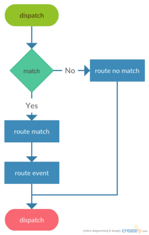

.. rst-class:: sub-monospace

===================
Application Routing
===================

.. contents::
    :depth: 1
    :local:

The router lets you define routes that triggers events you can handle by listeners. A route is basically a path which
is matched against request.

- Powered by `Zend Router <https://github.com/zendframework/zend-mvc>`__

**Explanation:**

**1)** Matching a route against request.

- Request made to your application contains a path to the "resource" the client is requesting.

- That request path is matched against available routes until one matches if any.

**2)** Emitting no route match event.

- When no route was matched, the no route event is emitted to which you can bind like following:

.. code-block:: php

    use WebinoAppLib\Event\DispatchEvent;
    use WebinoAppLib\Event\RouteEvent;

    /** @var WebinoAppLib\Application\AbstractApplication $app */
    $app->bind(RouteEvent::NO_MATCH, function (DispatchEvent $event) {
        // do something...
    });

**3)** Emitting route match event.

- On a route match, the route match event is emitted to which you can bind like following:

.. code-block:: php

    use WebinoAppLib\Event\RouteEvent;

    /** @var WebinoAppLib\Application\AbstractApplication $app */
    $app->bind(RouteEvent::MATCH, function (RouteEvent $event) {
        // do something...
    });

**4)** Emitting route event.

- The matched route event is emitted to which you can bind like following:

.. code-block:: php

    use WebinoAppLib\Event\RouteEvent;
    /** @var WebinoAppLib\Application\AbstractApplication $app */

    // via class
    $app->bind(MyRoute::class, function (RouteEvent $event) {
        // do something...
    });
    // or via string
    $app->bindRoute('myRoute', function (RouteEvent $event) {
        // do something...
    });

.. rst-class:: monospace-topic

Routing Interface
^^^^^^^^^^^^^^^^^

.. contents::
    :depth: 1
    :local:

.. include:: /guide/api/routing.rst.inc

.. rst-class:: body-font

Routing Config
^^^^^^^^^^^^^^

.. contents::
    :depth: 1
    :local:

.. include:: /guide/config/routing.rst.inc

Routing Events
^^^^^^^^^^^^^^

Following events are emitted during application routing.

.. contents::
    :depth: 1
    :local:

RouteEvent::MATCH
-----------------

*Route was matched.*

This event is emitted at beginning of application dispatch on route match.

.. code-block:: php

    use WebinoAppLib\Event\RouteEvent;

    $app->bind(RouteEvent::MATCH, function (RouteEvent $event) {});

RouteEvent::NO_MATCH
--------------------

*Can't match a route.*

This event is emitted at beginning of application dispatch when route can't be matched.

.. code-block:: php

    use WebinoAppLib\Event\DispatchEvent;
    use WebinoAppLib\Event\RouteEvent;

    $app->bind(RouteEvent::NO_MATCH, function (DispatchEvent $event) {});

Route Event Interface
^^^^^^^^^^^^^^^^^^^^^

.. contents::
    :depth: 1
    :local:

$event->getParam()
------------------

*Accessing route parameters.*

.. code-block:: php

    /** @var \WebinoAppLib\Event\RouteEvent $event */
    $myParam = $event->getParam('myParam');

$event->getRouteMatch()
-----------------------

*Obtaining matched route object.*

.. code-block:: php

    /** @var \WebinoAppLib\Event\RouteEvent $event */
    /** @var \Zend\Mvc\Router\Http\RouteMatch $routeMatch */
    $routeMatch = $event->getRouteMatch();

.. include:: /guide/cookbook/routing.rst.inc
